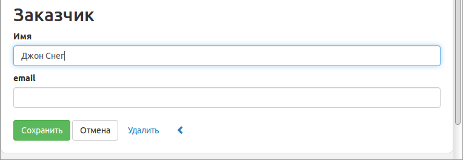
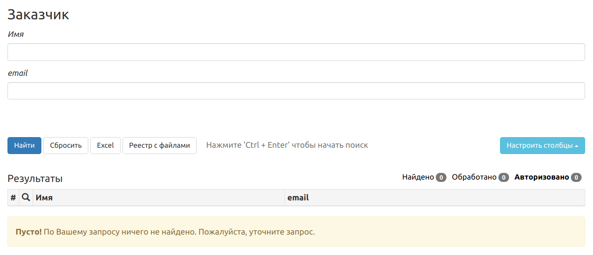

# Платформа VEDA. Руководство по разработке приложений.

*Данная документация актуальна для Veda версии 5.4.X*

**Содержание**

   * [Платформа VEDA. Руководство по разработке приложений](#платформа-veda-руководство-по-разработке-приложений)
      * [Предисловие](#предисловие)
         * [Общие сведения](#общие-сведения)
         * [Возможности и преимущества](#возможности-и-преимущества)
      * [1. Установка и настройка](#1-установка-и-настройка)
         * [1.1. Сервер](#11-сервер)
            * [1.1.1. Установка заранее собранной системы](#111-установка-заранее-собранной-системы)
            * [1.1.2. Самостоятельная сборка из исходных текстов](#112-самостоятельная-сборка-из-исходных-текстов)
            * [1.1.3. Настройка и запуск](#113-настройка-и-запуск)
         * [1.2. База данных](#12-база-данных)
         * [1.3. Модули](#13-модули)
         * [1.4. Клиентская часть, веб-браузер](#14-клиентская-часть-веб-браузер)
         * [1.5. Средства разработки](#15-средства-разработки)
      * [2. Быстрый старт](#2-быстрый-старт)
         * [2.1. Описание задачи](#21-описание-задачи)
         * [2.2. Создание проекта](#22-создание-проекта)
         * [2.3. Создание сущностей](#23-создание-сущностей)
         * [2.4. Создание форм пользовательского интерфейса](#24-создание-форм-пользовательского-интерфейса)
            * [2.4.1. Экраны управления Покупателями](#241-экраны-управления-покупателями)
            * [2.4.2. Экраны управления Заказами](#242-экраны-управления-заказами)
            * [2.4.3. Меню приложения](#243-меню-приложения)
            * [2.4.4. Экран редактирования Покупателя со списком Заказов](#244-экран-редактирования-покупателя-со-списком-заказов)
         * [2.5. Запуск приложения](#25-запуск-приложения)
            * [2.5.1 Загрузка онтологии](#251-загрузка-онтологии)
            * [2.5.2. Тестирование приложения](#252-тестирование-приложения)
      * [3. Устройство платформы](#3-устройство-платформы)
         * [3.1. Архитектура приложения](#31-архитектура-приложения)
            * [3.1.1. Уровни приложения](#311-уровни-приложения)
            * [3.1.2. Модули приложения](#312-модули-приложения)
         * [3.2. Архитектура платформы](#32-архитектура-платформы)
            * [3.2.1. Серверные компоненты и их функциональные блоки](#321-серверные-компоненты-и-их-функциональные-блоки)
            * [3.2.2. API для клиентского слоя](#322-api-для-клиентского-слоя)
         * [3.3. Жизненный цикл обработки информации](#33-жизненный-цикл-обработки-информации)
         * [3.4. Механизмы платформы](#34-механизмы-платформы)
            * [3.4.1. Поиск сущностей с фильтром](#341-поиск-сущностей-с-фильтром)
            * [3.4.2. Подсистема безопасности](#342-подсистема-безопасности)
               * [3.4.2.1 Пользователь системы](#3421-пользователь-системы)
               * [3.4.2.2. Аутентификация](#3422-аутентификация)
               * [3.4.2.3. Авторизация](#3423-авторизация)
               * [3.4.2.4. Создание схемы авторизации](#3424-создание-схемы-авторизации)
               * [3.4.2.5. Алгоритмы авторизации](#3425-алгоритмы-авторизации)
            * [3.4.2. Подсистема исполнения скриптов](#342-подсистема-исполнения-скриптов)
         * [3.5. Компоненты платформы исходящей информации](#35-компоненты-платформы-исходящей-информации)
            * [3.5.1. Отправка по e-mail](#351-отправка-по-e-mail)
            * [3.5.2. Выгрузка в SQL](#352-выгрузка-в-sql)
         * [3.6. Модули, поставляемые с платформой](#36-модули-поставляемые-с-платформой)
      * [4. Разработка приложений](#4-разработка-приложений)
         * [4.1. Файловая структура модуля](#41-файловая-структура-модуля)
         * [4.2. Создание проекта](#42-создание-проекта)
         * [4.3. Работа с модулями приложений](#43-работа-с-модулями-приложений)
         * [4.4. Логгирование](#44-логгирование)
      * [Основные определения и понятия](#основные-определения-и-понятия)
      * [ПРИЛОЖЕНИЯ](#приложения)
         * [Приложение 1. Автоматическое назначение прав автору сущности](#приложение-1-автоматическое-назначение-прав-автору-сущности)
         * [Приложение 2. Автоматическое распределение индивидов по авторизационным группам](#приложение-2-автоматическое-распределение-индивидов-по-авторизационным-группам)
         * [Приложение 3. Детали работы компонента по отправке электронных писем](#приложение-3-детали-работы-компонента-по-отправке-электронных-писем)
         * [Приложение 4. Особенности исполнения скриптов](#приложение-4-особенности-исполнения-скриптов)

----

## Предисловие

Данное руководство содержит справочную информацию по платформе VEDA и охватывает наиболее важные темы разработки бизнес-приложений на платформе.

Для успешного создания приложений требуется знание следующих технологий:

RDF/RDFS, OWL, Turtle, RDFa, HTML, CSS, JavaScript, git.

Для глубокого понимания принципов работы платформы необходимо знакомство со следующими технологиями и фреймворками:

linux(basic), http, websocket.

Если вы нашли ошибку в документе или хотите внести предложения по улучшению данного руководства, сделайте fork репозитория на GitHub. Мы будем рады принять ваши pull request’ы и issues.

### Общие сведения
VEDA - это платформа для создания и исполнения бизнес приложений. Исходный код платформы открыт для всех и распространяется бесплатно на условиях лицензии GPLv3.
В основе платформы лежат технологии семантического веба. Это означает, что при создании приложения предметная область (структуры данных и их взаимоотношения) формулируется с помощью словаря описания онтологий OWL/RDF.
Платформа имеет двухзвенную архитектуру и состоит из серверной части и клиентского приложения, выполняющегося в браузере пользователя.

### Возможности и преимущества
Технологии семантического веба дают возможность единообразно описать сущности предметной области. Единое информационное пространство для пользователей, работающих в приложениях платформы, обеспечивается повторным использованием ранее описанных понятий.
Платформа и используемые технологии помогают разработчику добиваться интеграции данных на семантическом уровне.
Изменения описаний структур данных приложения, при условии сохранения логической совместимости, загружаются в систему на лету и не требуют специальных действий по администрированию сервера.

## 1. Установка и настройка

### 1.1. Сервер
Сервер платформы состоит из набора онтологий, ряда js скриптов, а также нескольких бинарных файлов, которые требуется предварительно скомпилировать.
Есть возможность воспользоваться уже собранной платформой, для этого смотрите пункт [1.1.1 Установка заранее собранной системы](#111-установка-заранее-собранной-системы). В этом варианте количество установленных зависимостей значительно меньше, а также отсутствует время на компиляцию.

Если требуется вносить изменения в ядро платформы, то возможно самостоятельно собрать платформу, смотрите пункт [1.1.2 Самостоятельная сборка из исходных текстов](#112-самостоятельная-сборка-из-исходных-текстов). Необходимо учесть, что в этом случае вам понадобится не менее 2 ГБ оперативной памяти.

*Системные требования:*

- 64-битная операционная система - Ubuntu Linux 20.04,
- Оперативная память - 1 ГБ минимум, 4 ГБ рекомендуется,
- CPU - 2 ядра х 2.0 ГГц,
- Место на жестком диске - 5 ГБ.

#### 1.1.1. Установка заранее собранной системы
Готовую, собранную заранее платформу можно взять с сайта GitHub.
Для установки последней собранной версии платформы следует перейти по ссылке https://github.com/semantic-machines/veda/releases и скачать файл ```Veda-x86_64.AppImage.5.X.Y``` в отдельную, заранее созданную папку (5.X.Y - номер требуемой версии). Этот файл содержит упакованные бинарные файлы платформы и необходимые зависимости.

Далее установите атрибут запуска на файле ```Veda-x86_64.AppImage.5.X.Y```:

```
chmod +x Veda-x86_64.AppImage.5.X.Y
```

и запустите его.

При первичном запуске в папке, где находится файл ```Veda-x86_64.AppImage.5.X.Y```, появятся дополнительные файлы для последующих старта и остановки, будет создана папка для базы данных и распакуется онтология. Также появится файл ```install-tarantool.sh```. Если база данных Tarantool не была установлена ранее, то перед первым запуском выполните ее установку с помощью ```install-tarantool.sh```

#### 1.1.2. Самостоятельная сборка из исходных текстов
Исходные файлы проекта можно взять на сайте GitHub. Для этого выполните команду:

```
git clone https://github.com/semantic-machines/veda.git
```

Для работы серверной части системы потребуются компоненты от других разработчиков. Все они являются открытыми и могут быть установлены путем запуска скрипта:

```
./control-install.sh
```

После установки всех зависимостей можно выполнить сборку исполняемых файлов, для этого следует выполнить скрипт:

```
./build.sh
```

#### 1.1.3. Настройка и запуск
Настройки для конфигурирования сервера находятся в файле ```./veda.properties```.

На первом этапе вам может понадобиться внести изменения в настройки tcp портов.
По умолчанию сервер будет производить взаимодействие с клиентской частью по двум портам 8080 и 8088. При необходимости вы можете их перенастроить.

Порт, по которому пользователь будет попадать в систему, задается параметром - http_port.
Второй порт отвечает за отправку в клиентское приложение уведомлений об изменениях в данных и задается параметром ccus_port. Более подробно параметры конфигурирования сервера рассмотрены в разделе [Администрирование сервера].
Старт сервера производится командой:

```
./control-start.sh
```

При первом запуске, когда база данных пустая, может понадобиться некоторое время (примерно около минуты), в течении которого онтология платформы, располагающаяся в папке ```./onto```, будет переноситься в базу данных.
Последующие запуски будут выполняться без какой-либо задержки, практически мгновенно. После того, как серверная часть стартовала, можно перейти в браузер по адресу http://localhost:8080.

Остановку сервера можно произвести командой:

```
./control-stop.sh
```

### 1.2. База данных
Все файлы базы данных располагаются в папке ```./data```, которую при необходимости можно прилинковать за пределы рабочей папки платформы.
Мастер-данные хранятся в NoSQL базе данных [Tarantool](https://tarantool.io).
Производные данные, такие как индексы полнотекстового поиска и индексы авторизации, хранятся в других базах, к которым прямой доступ извне ограничен.

### 1.3. Модули
Платформа содержит в своем составе менеджер модулей, который позволяет устанавливать/удалять сторонние модули, учитывая версионность самих модулей и их зависимостей.

### 1.4. Клиентская часть, веб-браузер

*Системные требования:*

- операционная система - Windows, Linux, OSX
- Оперативная память - 1 ГБ минимум, 2 ГБ рекомендуется
- CPU - 2 ядра х 2.0 ГГц.

Веб-интерфейс приложений, создаваемых на основе платформы, работает в современных браузерах, таких как Google Chrome, Mozilla Firefox, Internet Explorer 11, Microsoft Edge.

### 1.5. Средства разработки

Как правило, в процессе создания приложения специальных средств разработки не требуется, достаточно простых текстовых редакторов.

Однако некоторые инструменты могут облегчить разработку, например, для редактирования онтологий можно использовать бесплатный open-source редактор [Protege](https://protege.stanford.edu/), либо более продвинутый инструмент [TopBraid Composer](https://www.topquadrant.com/products/topbraid-composer/).

## 2. Быстрый старт

В данном разделе рассматривается создание простого приложения.
В качестве средства разработки в данном примере будет использован обычный текстовый редактор.
При этом содержимое файла должно соответствовать правилам разметки [N3](https://ru.wikipedia.org/wiki/%D0%9D%D0%BE%D1%82%D0%B0%D1%86%D0%B8%D1%8F_3) для RDF данных.

Прежде, чем приступать к созданию тестового приложения, убедитесь, что вы выполнили рекомендованные действия из пункта [1. Установка и настройка](#1-установка-и-настройка).

Основные задачи, стоящие при разработке нашего приложения:

- Разработка модели данных, которая заключается в создании сущностей предметной области.

- Разработка экранных форм пользовательского интерфейса, позволяющих создавать, просматривать, обновлять и удалять сущности модели данных.

### 2.1. Описание задачи

Приложение предназначено для ведения сведений о покупателях и их заказах.

*Покупатель имеет следующие характеристики:*

- Имя,
- Электронная почта.


*Характеристики заказа:*

- Принадлежность покупателю,
- Дата,
- Сумма.


*Пользовательский интерфейс приложения должен содержать:*

- Форму списка покупателей;
- Форму редактирования сведений о покупателе, содержащую в том числе список заказов данного покупателя;
- Форму общего списка заказов;
- Форму редактирования заказа.

### 2.2. Создание проекта

В данном примере, для простоты, мы не будем использовать возможности менеджера модулей, более подробно с этой технологией можно ознакомиться в разделе [Менеджер модулей].

Для нашего примера создадим текстовый файл ```sales.ttl```, который в дальнейшем будет содержать в себе все сущности данного проекта.

**Заголовок файла проекта**:

```
@prefix owl: <http://www.w3.org/2002/07/owl#> .
@prefix rdf: <http://www.w3.org/1999/02/22-rdf-syntax-ns#> .
@prefix rdfs: <http://www.w3.org/2000/01/rdf-schema#> .
@prefix cs: <http://company-sales.com/sample/sales/> .

<http://company-sales.com/sample/sales>
  rdf:type owl:Ontology ;
  rdfs:isDefinedBy cs: ;
  rdfs:label "Тестовый пример - Продажи"@ru ;
  rdfs:label "Sample - Sales"@en ;
.
```
**Рассмотрим, из чего состоит заголовок файла.**

В самой верхней части файла мы описываем префиксы, содержащие в себе ссылки на сторонние онтологии. Префикс для нашего проекта зададим следующим образом:

```
@prefix cs: <http://company-sales.com/sample/sales/> .
```
где **cs:** - пространство имен, которое будет использоваться как префикс имен сущностей нашего примера.

**http://company-sales.com/sample/sales/** - ссылка на репозиторий онтологий нашей вымышленной компании.

Далее идет сущность, которая будет корневой для других сущностей нашей бизнес области.

```
<http://company-sales.com/sample/sales>
  rdf:type owl:Ontology ;
  rdfs:isDefinedBy cs: ;
  rdfs:label "Тестовый пример - Продажи"@ru ;
  rdfs:label "Sample - Sales"@en .
```

### 2.3. Создание сущностей

Создадим класс сущности **Customer (Покупатель)**.

```
cs:Customer
  rdf:type rdfs:Class ;
  rdfs:label "Customer"@en ;
  rdfs:label "Покупатель"@ru .
```

Обратите внимание, что **cs:Customer** - это экземпляр класса **rdfs:Class**, таким образом мы описываем новый класс.

Далее создадим атрибуты сущности.

Начнем с аттрибута **name**, для этого создадим экземпляр класса **owl:DatatypeProperty**:

```
cs:name
  rdf:type owl:DatatypeProperty ;
  rdfs:label "Имя"@ru ;
  rdfs:label "Name"@en ;
  rdfs:domain cs:Customer ;
  rdfs:range xsd:string .
```

Здесь поле **rdfs:domain** указывает принадлежность атрибута **cs:name** к классу **cs:Customer**,
а поле **rdfs:range** задает тип **string** для хранимых данных в данном атрибуте.
Так же мы стали использовать новый префикс **xsd:**, поэтому его следует внести в заголовок нашего файла.

Теперь верхняя часть файла с описанием префиксов будет выглядеть так:

```
@prefix owl: <http://www.w3.org/2002/07/owl#> .
@prefix rdf: <http://www.w3.org/1999/02/22-rdf-syntax-ns#> .
@prefix rdfs: <http://www.w3.org/2000/01/rdf-schema#> .
@prefix xsd: <http://www.w3.org/2001/XMLSchema#> .
@prefix cs: <http://company-sales.com/sample/sales/> .
```

Атрибут **email** создается таким же образом:

```
cs:email
  rdf:type owl:DatatypeProperty ;
  rdfs:label "email" ;
  rdfs:domain cs:Customer ;
  rdfs:range xsd:string .
```

На этом создание сущности **Customer** можно считать завершенным.

Перейдем к созданию сущности **Order (Заказ)**.

```
cs:Order
  rdf:type rdfs:Class ;
  rdfs:label "Order"@en ;
  rdfs:label "Заказ"@ru .
```

Опишем ее атрибуты:

```
cs:hasCustomer
  rdf:type owl:ObjectProperty ;
  rdfs:label "has customer"@en ;
  rdfs:domain cs:Order ;
  rdfs:range cs:Customer .
```

Обратите внимание, что для описания ссылки на другую сущность мы создали экземпляр класса **owl:ObjectProperty**.

Создадим оставшиеся атрибуты **date** и **amount**:

```
cs:date
  rdf:type owl:DatatypeProperty ;
  rdfs:label "date" ;
  rdfs:domain cs:Order ;
  rdfs:range xsd:dateTime .

cs:amount
  rdf:type owl:DatatypeProperty ;
  rdfs:label "amount" ;
  rdfs:domain cs:Order ;
  rdfs:range xsd:decimal .
```

Описание объектной модели завершено, переходим к описанию экранных форм.

### 2.4. Создание форм пользовательского интерфейса

*Отображение, ввод данных и поиск можно задать с помощью таких объектов как **шаблон**.*

Создадим формы приложения, позволяющие управлять информацией о Покупателях и Заказах.

Для этого нам понадобится спроектировать объекты-шаблоны содержащие HTML разметку. Такие шаблоны определят внешний вид классов и поведение пользовательского интерфейса для пользователя.

#### 2.4.1. Экраны управления Покупателями

Приступим к созданию нашего первого шаблона.

Для этого создадим обьект класса **v-ui:ClassTemplate**, в поле **v-ui:template** впишем HTML код. Таким образом, мы сможем задать поведение пользовательского интерфейса для класса **cs:Customer**.
Несмотря на то, что шаблон из этого примера описывает поведение класса **cs:Customer**,  один шаблон может быть применим и для нескольких классов.

В нашем шаблоне будет всего два поля, это **Имя заказчика** и его **E-mail**.

**Так шаблон будет отображаться при вводе данных о покупателе:**


<center><b>Рисунок 1. Шаблон в режиме редактирования.</b></center>

<br>

**Так при поиске покупателей:**



<center><b>Рисунок 2. Шаблон в режиме поиска.</b></center>

<br>

**Шаблон в виде объекта:**

```html
cs:CustomerTemplate
  rdf:type v-ui:ClassTemplate ;
  rdfs:label "Template for cs:Customer class"@en ;
  rdfs:label "Шаблон для класса cs:Customer"@ru ;
  v-ui:template """
<div class="sheet container">
  <h2 about="@" rel="rdf:type" data-template="v-ui:LabelTemplate"></h2>

  <em about="cs:name" property="rdfs:label"></em>
  <div class="view -edit search" property="cs:name"></div>
  <veda-control property="cs:name" data-type="string" class="-view edit search">
  </veda-control>

  <em about="cs:email" property="rdfs:label"></em>
  <div class="view -edit search" property="cs:email"></div>
  <veda-control property="cs:email" data-type="string" class="-view edit search">
  </veda-control>

  <div about="@" class="container sheet view -edit -search" data-template = "cs:OrdersByCustomerTemplate"></div>
  <br>
  <div class="actions view edit -search">
    <span about="@" data-template="v-ui:StandardButtonsTemplate" data-embedded="true" data-buttons="save edit cancel delete journal task"></span>
  </div>
</div>
  """ ;
.
```
**Разберем подробнее устройство вышеприведенной HTML разметки.**

Разметка шаблона базируется на существующем формате описания ресурсов в атрибутах [RDFa](https://en.wikipedia.org/wiki/RDFa).

Один шаблон может быть задан как для отображения, так и для ввода, и для поиска данных. Что следует скрывать, а что показывать, задается в атрибуте **class** значениями **view, edit, search**.  Если не указать эти значения, то по умолчанию будут действовать все сразу. Если какое-то значение необходимо скрыть, то следует указать знак **"-"** перед значением класса. Пример: **class="view -edit search"** - элемент разметки будет доступен в режиме view и search, а в режиме edit будет скрываться.


Итак, первая строка шаблона:

```html
 <h2 about="@" rel="rdf:type" data-template="v-ui:LabelTemplate">
```

Содержит следующие атрибуты:

```about="@"``` - говорит о том, что в данном шаблоне будет происходить обработка текущего (переданного извне) объекта. При необходимости, вместо "@" можно подставить ID любого другого объекта;

```rel="rdf:type"``` - у обрабатываемого объекта берется поле **"rdf:type"** и его значение далее передается другому шаблону, который указывается атрибутом ```data-template="v-ui:LabelTemplate"```;

```data-template="v-ui:LabelTemplate"``` - указывает на то, что при отображении будет использован шаблон **v-ui:LabelTemplate**.

Как это работает: из текущего индивида, будет взято поле **rdf:type**, далее по полученному значению **cs:Customer** будет взят этот обьект и уже из него шаблоном **v-ui:LabelTemplate** извлекается и отображается значение поля **rdfs:label**.

```html
<em about="cs:name" property="rdfs:label"></em>
```

Здесь мы выведем на экран название поля **cs:name**, оно было описано ранее при рассмотрении свойств  класса **cs:Customer** [2.3 Создание сущностей](#23-создание-сущностей).

```html
<div class="view -edit search" property="cs:name"></div>
```

Это вывод на экран значений свойства **cs:name** у текущего индивида.

Обратите внимание, что данный элемент будет срабатывать для режима view и search, а при вводе не будет. Задается такое поведение выражением ```class="view -edit search"```.

```html
<veda-control property="cs:name" data-type="string" class="-view edit search"></veda-control>
```

Такой строкой задается собственно само поле ввода данных,  за это отвечает тег **veda-control**, а атрибут **data-type** задает тип вводимых данных.

Подобным образом в описании шаблона задается поле **cs:email**:

```html
<em about="cs:email" property="rdfs:label"></em>
<div class="view -edit search" property="cs:email"></div>
<veda-control property="cs:email" data-type="string" class="-view edit search"></veda-control>
```

Следующая часть шаблона ссылается на другой шаблон **cs:OrdersByCustomerTemplate**, отображающий заказы по данному покупателю. Как видно из атрибута class, данный элемент будет доступен только в режиме view.

```html
<div about="@" class="container sheet view -edit -search" data-template = "cs:OrdersByCustomerTemplate"></div>
```

Осталось рассмотреть кнопки, отвечающие за финальное действие пользователя в данном шаблоне:

```
 <div class="actions view edit -search">
    <span about="@" data-template="v-ui:StandardButtonsTemplate" data-embedded="true" data-buttons="save edit cancel delete journal task"></span>
  </div>
```

Кнопки рисуются шаблоном **v-ui:StandardButtonsTemplate**, и дополнительно во вложенный шаблон передаются два параметра **data-embedded** и **data-buttons**. Первый параметр означает, что режим отображения вложенных шаблонов будет совпадать с режимом родительского шаблона. Второй параметр задает список кнопок, доступных для нашего шаблона.


#### 2.4.2. Экраны управления Заказами

Шаблон, управляющий заказами, практически идентичен шаблону покупателей, поэтому расcмотрим только отличия:

```
cs:OrderTemplate
  rdf:type v-ui:ClassTemplate ;
  rdfs:label "Template for cs:Order class"@en ;
  rdfs:label "Шаблон для класса cs:Order"@ru ;
  v-ui:template """
<div class="sheet container">
  <h2 about="@" rel="rdf:type" data-template="v-ui:LabelTemplate"></h2>

  <em about="cs:hasCustomer" property="rdfs:label"></em>
  <div class="view -edit search" rel="cs:hasCustomer" data-template="v-ui:LabelLinkTemplate"></div>
  <veda-control rel="cs:hasCustomer" data-type="link" class="-view edit search fulltext dropdown"></veda-control>

  <em about="cs:date" property="rdfs:label"></em>
  <div class="view -edit search" property="cs:date"></div>
  <veda-control property="cs:date" data-type="date" class="-view edit search"></veda-control>

  <em about="cs:amount" property="rdfs:label"></em>
  <div class="view -edit search" property="cs:amount"></div>
  <veda-control property="cs:amount" data-type="integer" class="-view edit search"></veda-control>
  <br>
  <div class="actions view edit -search">
    <span about="@" data-template="v-ui:StandardButtonsTemplate" data-embedded="true" data-buttons="save edit cancel delete journal task"></span>
  </div>
</div>
  """ ;
.
```


```
<veda-control rel="cs:hasCustomer" data-type="link" class="-view edit search fulltext dropdown"></veda-control>
```

Эта строка описывает контрол для ввода информации. Атрибут ```data-type="link"``` означает, что этот контрол используется для ввода ссылочного значения. Поддерживаемые типы контролов: ```string, multilingualString, text, multilingualText, integer, decimal, date, dateTime, select, radio, checkbox```.

#### 2.4.3. Меню приложения

-

#### 2.4.4. Экран редактирования Покупателя со списком Заказов

-

### 2.5. Запуск приложения

Посмотрим, как созданное нами описание выглядит в виде готового приложения.

#### 2.5.1 Загрузка онтологии

Убедитесь, что сервер запущен, или произведите его запуск командой:

```
./control-start.sh
```

Один из путей размещения онтологии на сервер - это поместить файл ```sales.ttl``` в папку ```./onto```. Cервер должен обнаружить новый файл, проверить его и, если синтаксис не нарушен, внести изменения в базу данных.

#### 2.5.2. Тестирование приложения

Зайдите в систему, использовав имя [admin] и пароль [123] в окне логина. Откройте пункт меню ?


## 3. Устройство платформы

Глава содержит подробное описание архитектуры, компонентов и механизмов платформы.

### 3.1. Архитектура приложения

В данной главе рассмотрена архитектура VEDA-приложений в различных разрезах: по уровням и модулям.

#### 3.1.1. Уровни приложения

Платформа позволяет строить многоуровневые приложения с выделенными клиентским и серверным уровнями.

**Сервер**

Слой, содержащий описание предметной области, клиентскую и серверную бизнес-логику приложения и выполняющий обращения к базе данных.

**Клиент**

Приложение, выполняющееся в веб-браузере на JavaScript, и предоставляющее пользовательский интерфейс для внешних пользователей. Поведение и внешний вид клиента зависят от описания предметной области и клиентской бизнес-логики, которые хранятся на уровне сервера.
Клиентская часть работает с серверным слоем через HTTP API и websocket.

#### 3.1.2. Модули приложения

**Модуль**

Это набор из связанных между собой ресурсов. В набор входят следующие виды файлов:

- онтологии, размещенные в ttl файлах,
- компоненты, необходимые для построения пользовательского UI (css, fonts, images ...),
- JavaScript библиотеки и скрипты, необходимые для работы модуля,
- описание модуля и его зависимостей,
- тесты.

Приложение для своего функционирования может требовать наличия других модулей, это задается в разделе зависимости, в сущности, описывающей модуль.

Само приложение тоже является модулем и может в дальнейшем использоваться для построения других приложений.


### 3.2. Архитектура платформы

В данной главе рассмотрена архитектура платформы VEDA в разрезе компонентов и функциональных блоков, а также структура и направление потоков информации.

#### 3.2.1. Серверные компоненты и их функциональные блоки

- **veda-mstorage**

  - Аутентификация.
  - Авторизация изменений.
  - Запись в основное хранилище сущностей.
  - Индексация сущностей для последующей авторизации.
  
- **veda-ft-indexer**

  - Индексация сущностей для полнотекстового поиска.
  
- **veda-ft-query** (возможен одновременный запуск необходимого количества)
  
  - Выполнение запросов к полнотекстовому поиску.
  - Авторизация полученных результатов.
  
- **veda-fanout-email**

  - Отправка по e-mail.
  
- **veda-fanout-sql-np**

  - Выгрузка в SQL.
  
- **veda-scripts**

  - Исполнение скриптов.
  
- **veda-ttlreader**

  - Чтение ttl файлов, извлечение из них сущностей.
  - Подключение к очереди другого экземпляра системы Veda.
  
- **veda-ccus**

  - Обслуживание websocket API (уведомление об изменениях).
  
- **veda-gowebserver** (возможен одновременный запуск множества веб-серверов)

  - Обслуживание HTTP API.
  - Авторизация запрашиваемых сущностей.


<center><b>Рисунок 3. Функциональные части платформы Veda и движение потоков информации.</b></center>

<br>

#### 3.2.2. API для клиентского слоя

**HTTP API предоставляет следующую функциональность:**

- Аутентификация пользователя и получение сессионного билета;
- Проверка сессионного билета на валидность;
- Сохранение одной или нескольких сущностей;
- Получение одной или нескольких сущностей по их ID;
- Удаление сущности;
- Добавление, обновление, удаление заданного поля в сущности;
- Получение разрешений для текущего пользователя и сущности;
- Загрузка и скачивание файлов;
- Получение информации о текущей позиции в очереди для каждого серверного компонента;
- Поддержка анонимного доступа c ограниченными правами.

**Websocket API служит для оперативного получения изменений в сущностях и состоит из следующих команд:**

- Получить текущий набор подписок;
- Подписаться на изменения одной или нескольких сущностей;
- Отменить подписку для  одной или нескольких сущностей;
- Отменить все подписки.


### 3.3. Жизненный цикл обработки информации

*Пути поступления информации в систему:*

1. Чтение ttl файлов, доступ к которым имеет серверная часть.
2. HTTP API:
   - Пользователь посредством веб интерфейса производит создание или модификацию сущностей;
   - Другие системы могут получать и отправлять сущности.
3. Чтение очереди другого экземпляра системы Veda.

*Обработка поступившей информации на стороне сервера:*

На серверной стороне компонент хранения обрабатывает поступившие сущности и после проверки прав доступа сохраняет в мастер-базу, а также складывает в очередь. При этом в очередь сохраняются два состояния: сущность до изменений и ее новое состояние.
Далее компонент хранения уведомляет остальные части системы  о поступлении новых данных. На следующей стадии каждый из компонентов считывает из очереди новую порцию данных, и исходя из содержимого, делает вывод - следует обрабатывать или следует пропустить.
Каждый из компонентов системы может содержать свои базы данных и алгоритмы работы. В процессе обработки поступившей сущности могут быть сгенерированы новые сущности, которые будут отправлены в компонент хранения, и далее цикл обработки повторится.


### 3.4. Механизмы платформы

#### 3.4.1. Поиск сущностей с фильтром

Платформа даёт возможность искать экземпляры сущностей по определенным условиям. Это возможно выполнить как из HTTP API, так и из хранимых скриптов.

В этом разделе рассматриваются способы составление поисковых запросов.

В общем виде запрос представляет собой выражение, в котором должны быть две строки, между которыми располагается оператор сравнения.

```'ПОЛЕ'  [оператор сравнения]  'ЗНАЧЕНИЕ'```

**Таблица 1. Операторы сравнения.**

| Оператор | Функция                                                      |
| :------: | :----------------------------------------------------------- |
|    &&    | И                                                            |
|   \|\|   | ИЛИ                                                          |
|    ==    | Сравнение с учетом иерархии классов                          |
|   ===    | Более строгий, чем == поиск, то есть ищет только тот класс, который указан |

**ЗНАЧЕНИЕ** может быть заключено в одиночные кавычки для строк, или в квадратные скобки для диапазонов.

Далее можно усложнять запрос путем комбинирования выражений с помощь логических операторов и скобок.

Пример запроса: 
```('ПОЛЕ1' == 'ТЕКСТ1' && 'ПОЛЕ2' == 'ТЕКСТ2') || '*' == 'ТЕКСТ3'```

В следующих двух таблицах описываются возможные значения для левой (ПОЛЕ) и правой (ЗНАЧЕНИЕ) частей выражения.

**Таблица 2. Возможные значения для левой части выражения (ПОЛЕ).**

| ПОЛЕ             |                                                              |
| ---------------- | ------------------------------------------------------------ |
| '@'              | Искать в ID сущности                                         |
| '*'              | Искать в любом поле                                          |
| 'ПОЛЕ1.isExists' | Можно узнать, есть ли хоть какое-то значение в поле              |
| 'ПОЛЕ1.ПОЛЕ1'    | Вложенные поля (перед применением требуется предварительное описание) |
| '#123'           | Искать в поле, имеющем внутренний ID = 123                   |
| 'v-s:deleted'    | Для поиска удаленных объектов в запрос необходимо добавить условие 'v-s:deleted' === true |
| 'rdf:type'       | Косвенно можно указать в какой коллекции искать, по умолчанию поток индексации делится на несколько частей: basic, system, az и deleted |

**Таблица 3. Возможные значения для правой части выражения (ЗНАЧЕНИЕ).**

| ЗНАЧЕНИЕ                   |                                                              |
| -------------------------- | ------------------------------------------------------------ |
| 'XAPIAN QL'                | Строка, содержащая фильтр синтаксису поискового движка Xapian: https://xapian.org/docs/queryparser.html |
| ''ТЕКСТ*''                 | Не определено окончание и будут использованы все словоформы для ТЕКСТ, но не более 20 000 вариантов этого слова |
| true/false                 | Булевы значения                                              |
| [ЗНАЧЕНИЕ ОТ, ЗНАЧЕНИЕ ДО] | Поиск по диапазонам                                          |

**Таблица 4. Примеры запросов.**

| Запрос                                                       | Что ищем                                                     |
| ------------------------------------------------------------ | ------------------------------------------------------------ |
| '*' == 'лесовик'                                             | Сущности, содержащие слова [лесовик] по любому полю всех сущностей |
| '\*' == 'лес*'                                               | Сущности, содержащие слова, начинающиеся на [лес] по любому полю всех сущностей |
| '\*' == 'лес\*' && '\*' == 'вод*'                            | Сущности, содержащие слова, начинающиеся на [лес] И начинающиеся на [вод] по любым полям всех сущностей |
| '\*' == 'лес\*' \|\| '\*' == 'вод\*'                         | Сущности, содержащие слова, начинающиеся на [лес] ИЛИ начинающиеся на [вод] по любым полям всех сущностей |
| '\*' == 'лес\*' && ('\*' == 'вод\*' \|\| '\*' == 'мотор\*')  | Сущности, содержащие слова, начинающиеся на [лес] И начинающиеся на [вод] или [мотор] по любым полям всех сущностей |
| 'rdfs:label' == 'лес*'                                       | Сущности, содержащие слова, начинающиеся на [лес] по полю rdfs:label |
| 'v-s:owner.isExists' == 'true'                               | Сущности, содержащие поле v-s:owner с любым содержимым        |
| 'rdf:type' == 'v-s:Organization'                             | Сущности с типом v-s:Organization                            |
| 'rdf:type' === 'mnd-s:Idea'  &&  'v-s:created' == [2017-05-31T21:00:00.000Z, 2017-06-30T20:59:59.999Z] | Сущности типа mnd-s:Idea с датой создания в диапазоне от 2017-05-31 21:00:00.000 до 2017-06-30 20:59:59.999 |
| 'rdf:type' === 'mnd-s:Idea'  && 'v-s:deleted' === true       | Сущности типа mnd-s:Idea, которые были удалены                |
| 'rdf:type' === 'v-wf:Process'                                | Сущности типа v-wf:Process, однако, найти такие можно только, если явно указать тип v-wf:Process |
| '*' == '+лес +вод'                                           | Сущности, содержащие слова [лес] + [вод] вместе в любых полях |
| '*' == '(№177 177а, 2017-06-28)'                             | Сущности, содержащие фрагменты токенов [№177 177а], [2017-06-28] в любых полях |
| '*' == '"(№177 177а, 2017-06-28)"'                           | Сущности, содержащие точную фразу [(№177 177а, 2017-06-28)] в любых полях |
| '@' === 'v-s:Organization'                                   | Находим сущности с ID = v-s:Organization                     |

* по умолчанию весь поиск происходит по коллекции basic
* схема индексации находится в файле онтологии ```veda-index.ttl```

* есть сортировки по набору полей и указания, сколько нужно будет выбрать сущностей (TOP), сколько всего просматривать в запросе (LIMIT), и сколько отступить при выборке TOP, (FROM)

* протестировать запросы можно в запущенном приложении: http://localhost/#/search


#### 3.4.2. Подсистема безопасности

Платформа позволяет задать ограничение для пользователей на доступ к сущностям и их изменение.
Охраняемую сущность далее будем называть **ресурс**.

##### 3.4.2.1 Пользователь системы

Для каждого пользователя системы создается соответствующий экземпляр сущности типа **v-s:Person**.

**Пример сущности - Пользователь:**

```
d:employee_000641 a v-s:Person;
    rdfs:label "Владимир Ермаков"@ru, "Vladimir Ermakov"@en;
    v-s:firstName "Владимир"@ru, "Vladimir"@en;
    v-s:lastName "Ермаков"@ru, "Ermakov"@en;
    v-s:middleName "Федорович"@ru;
    v-s:parentOrganization d:org_RU113135;
    v-s:hasAccount d:account_ErmakovV;
    v-s:hasAppointment d:appointment_000641_71015521;
    v-s:hasAspect d:employee_000641_aspect;
    v-s:hasCommunicationMean d:phone_000641, d:email_000641;
    v-s:hasImage v-s:DefaultPhoto;
    v-s:tabNumber "641".
```


##### 3.4.2.2. Аутентификация

Пользователь в начале работы с системой должен получить сессионный тикет. Для этого он отправляет на сервер данные, с помощью которых происходит его идентификация. Для получения тикета необходимо передать логин и хеш (SHA-256), взятый от пароля. Полученный тикет имеет ограниченное время жизни. Если делать запросы после истечения времени жизни тикета, то будет возвращаться соответствующий код ошибки. Сущность пользователя содержит ссылку на его аккаунт в поле  **v-s:hasAccount**. Логин пользователя хранится в сущности типа **v-s:Account** в поле **v-s:login**.

**Пример сущности - Учетная запись:**

```
d:account_ErmakovV a v-s:Account;
    rdfs:label "ErmakovV";
    v-s:login "ErmakovV";
    v-s:mailbox "vladimir.ermakov@mgroup.com";
    v-s:owner d:employee_000641;
    v-s:usesCredential d:account_ErmakovV-crdt.
```

Пароль пользователя, вернее его хеш, хранится в отдельной сущности, которая доступна только супер пользователям, ссылка на эту сущность задается полем **v-s:usesCredential**.

##### 3.4.2.3. Авторизация

Для работы авторизации требуется тикет, полученный ранее в процедуре аутентификации. Авторизация выполняется для каждой запрашиваемой сущности и действует как на единичный запрос по uri, так и на результаты запроса к полнотекстовому поиску.

##### 3.4.2.4. Создание схемы авторизации

Задается схема авторизации с помощью сущностей следующих классов: **v-s:Group, v-s:Membership, v-s:PermissionStatement**.

С помощью сущностей **v-s:Group** можно задать группы как для пользователя, так и для защищаемого ресурса. Затем созданные ранее группы следует связать в дерево с помощью сущностей класса **v-s:Membership**. Должно получиться два не связанных между собой дерева - одно для пользователя, другое для защищаемого ресурса. Последним этапом будет связывание этих деревьев между собой с помощью сущностей **v-s:PermissionStatement**.

В базовой поставке уже есть ряд скриптов, которые занимаются созданием групп, помещением в них пользователей и ресурсов в зависимости от их содержимого и текущей ситуации. Пример: [Генерация схемы для поля v-s:author](#скрипты-отвечающие-за-назначение-прав-автору-новой-сущности)

##### 3.4.2.5. Алгоритмы авторизации

*Базовые алгоритмы авторизации*

При выполнении проверки прав доступа (на сервере):

- По тикету вычисляется пользователь.
- Производится извлечение всех групп, в которых состоит пользователь, с учетом вложенности групп друг в друга.
- Производится извлечение всех групп, в которых состоит запрашиваемый ресурс, с учетом вложенности групп друг в друга.
- Производится извлечение подходящих записей авторизации, в которых есть группа пользователя и группа ресурса с необходимым уровнем прав, и вычисление прав с учетом ограничений, установленных в группах.

*Дополнительные алгоритмы, накладывающие ограничение на полученные права*

Такие ограничения позволяет наложить запрет на права, полученные пользователем косвенным образом.

**Ограниченные права на основе признака**

Данный вид прав позволяет установить ограничение на отдельный ресурс. Может применяться для временного выключения прав на ресурс для большинства пользователей и взамен включения точечных прав для небольшой группы пользователей. Алгоритм ограничения действует в две фазы.

В первой фазе для всех пользователей включается ограничение прав на ресурс.
Для этого следует описать сущность типа **v-s:PermissionFilter**, у которой в поле **v-s:permissionObject** устанавливаем uri ресурса, на который накладываются ограничения. В поле **v-s:resource** задаем общий для обеих фаз маркер. Также необходимо задать мощность ограничительных прав.  Сразу после создания вышеописанной сущности, вычисляемые права на ресурс будут возвращаться как "не выше заданных".

**Пример сущности для первой фазы.**
Здесь мы ограничиваем всем пользователям их права до Read:

```
mnd-s:test_permissionFilter_1
  rdf:type v-s:PermissionFilter ;
  v-s:permissionObject d:a1kemm4f21polivjc6aqo6gp1kg ;
  v-s:resource v-s:StatusStarted ;
  v-s:canRead "true"^^xsd:boolean.
```

Во второй фазе выдаем разрешающие права для некоторых пользователей.
Для этого следует описать сущность типа **v-s:PermissionStatement**. В поле **v-s:useFilter** следует задать общий для обеих фаз маркер. Поля **v-s:permissionObject** и **v-s:permissionSubject** задают связку выдаваемого права с ресурсом и пользователем.

**Пример сущности для второй фазы.**
Здесь мы выдаем пользователю d:employee_00051114 право на Update на защищаемый ресурс:

```
mnd-s:test_permissionFilter_permission_1
  rdf:type v-s:PermissionStatement ;
  v-s:useFilter v-s:StatusStarted ;
  v-s:permissionObject d:a1kemm4f21polivjc6aqo6gp1kg ;
  v-s:permissionSubject d:employee_00051114;
  v-s:canUpdate "true"^^xsd:boolean.
```

При пометке сущности из первой фазы как "удаленной", вызовет отключение ограничения и отзыв выданного права из второй фазы.


**Ограниченные права на основе групп**

Данный вид прав позволяет ограничить доступ для отдельных групп пользователей. Может потребоваться при условии, что в системе есть пользователи из разных организаций.

Для этого следует создать включение в группу со специальным признаком **v-s:isExclusive = true**:

```
mnd-s:InternalDocumentToCompany1_membership
  rdf:type v-s:Membership ;
  v-s:memberOf mnd-s:InternalDocument_group ;
  v-s:resource d:org_Company1 ;
  rdfs:label "Внутренние документы доступные для Компании 1" ;
  v-s:isExclusive "true"^^xsd:boolean .
```

После внесения такой записи, для пользователей, входящих по иерархии в группу **d:org_Company1**, на обычную для них авторизацию будет налагаться ограничение:
   - теперь авторизуемый обьект должен входить по иерархии **CLASS_GROUP_HIERARCHY** в группу **mnd-s:InternalDocument_group**, иначе он не будет доступен.

Структура **CLASS_GROUP_HIERARCHY**:
   - группы, содержащие **v-s:isExclusive = true** в иерархию не входят;
   - в 0 уровень могут входить любые группы;
   - для уровня > 0 предыдущий уровень должен содержать строку **'_group'** или **сfg:TTLResourcesGroup_**;
   - сущности, не имеющие на первом уровне иерархии групп с **'_group'** или **сfg:TTLResourcesGroup**, считаются системными и на них не действуют ограничения.

*ВНИМАНИЕ!
При наличии хотя бы одной записи о включения в группу с признаком **v-s:isExclusive**, для ограничивающей группы пользователей произойдет потеря всех прав, кроме прав на онтологию и прав, разрешаемых с помощью этой записи.*


#### 3.4.2. Подсистема исполнения скриптов

Серверная часть платформы имеет возможность исполнения по событию заранее внесенного в систему скрипта. Скрипты исполняются в момент, когда произошло обновление сущности.

По сути, скрипт в **v-s:Event** - это аналог триггера в SQL. Вернуть он ничего не может, но в нем можно создать или изменить любую сущность.

Есть два пути внесения в систему необходимых скриптов:

1. Создать сущность с типом **v-s:Event**
   В поле **v-s:script**  записывается непосредственно код скрипта, поле **v-s:triggerByType** дает возможность отфильтровать события по измерению сущностей только определенного типа.

Пример:

```
cfg:Event_Notify_Task
  rdf:type v-s:Event ;
  v-s:author cfg:VedaSystemAppointment ;
  rdfs:label "Скрипт уведомления о новой задаче" ;
  v-s:triggerByType v-wf:UserTaskForm ;
  v-s:script """
    var task_id = document["@"],
    to = getUri(document["v-wf:to"]);
    print("cfg:Event_17", "caught", "task", task_id, "to", to);
  """ .
```

2. Разместить код в файловой системе в папке ```./public/js```.
   Однако такие скрипты невозможно привязать к событиям обновления сущности, но их можно вызвать из **v-s:Event**.
   Разработчик имеет возможность сформировать базовый набор утилит для последующего использования в сущностях типа **v-s:Event**.

   [Особенности исполнения скриптов](#особенности-исполнения-скриптов)


### 3.5. Компоненты платформы исходящей информации

#### 3.5.1. Отправка по e-mail

Для отправки по e-mail используются сущности, унаследованные от **v-s:Deliverable**.

Если содержимое сущности соответствует условиям отправки, формируется электронное письмо, которое затем будет отправлено на почтовый сервер, описанный в конфигурационной сущности типа **v-s:Node**.

Пример сущности, подходящей для отправки электронного письма:

```
d:ozabcpshvocf21d7z-msg a v-s:Email;
    v-s:hasMessageType v-s:TaskReceivedNotification;
    v-wf:from cfg:AdministratorAppointment;
    v-wf:to d:31a572f0-a3aa-81ce4787277b ;
    v-s:subject "Optiflow. Задача: 'Доработать' по документу 'Мероприятие встречи'"@ru;
    v-s:messageBody """
    Уважаемый пользователь, Бычин А. Специалист\n\n
    Вы получили задачу 'Доработать', Ок Срок продлен\n
    По документу 'Мероприятие встречи'\n\n
    Задачу направил  Администратор . Специалист\n\n
    Это сообщение сформировано автоматически. Отвечать на него не нужно.\n
    Система Optiflow\n"""@ru .
```

[Детали работы компонента по отправке электронных писем](#детали-работы-компонента-по-отправке-электронных-писем)


#### 3.5.2. Выгрузка в SQL

Для выгрузки в SQL используются сущности, унаследованные от **v-s:Exportable**.

Если содержимое сущности соответствует условиям выгрузки, формируется ряд запросов к SQL-серверу на обновление или вставку данных. Выгрузка происходит по всем полям сущности. Для каждого из полей формируется отдельная SQL-таблица.

Параметры подключения к SQL-серверу описываются конфигурационной сущностью типа **v-s:Node**.

**Пример сущности и сформированных по ее содержимому SQL-запросов:**

```
cfg:Admin1 a v-s:Person;
    v-s:birthday "2014-03-04T21:00:00.000Z"^^xsd:dateTime;
    v-s:firstName "Администратор"@ru, "Administrator"@en.
```

```
INSERT INTO `rdf:type` (doc_id, doc_type, created, value, lang, deleted)
VALUES (cfg:Admin1, v-s:Person, 2019-03-26T11:33:25Z, v-s:Person, NONE 0);

INSERT INTO `v-s:firstName` (doc_id, doc_type, created, value, lang, deleted)
VALUES (cfg:Admin1, v-s:Person, 2019-03-26T11:33:25Z, Администратор, RU 0);

INSERT INTO `v-s:firstName` (doc_id, doc_type, created, value, lang, deleted)
VALUES (cfg:Admin1, v-s:Person, 2019-03-26T11:33:25Z, Administrator, EN 0);

INSERT INTO `v-s:birthday` (doc_id, doc_type, created, value, lang, deleted)
VALUES (cfg:Admin1, v-s:Person, 2019-03-26T11:33:25Z, 2014-03-04T21:00:00Z, NONE 0);
```


### 3.6. Модули, поставляемые с платформой

- Базовая онтология
- Версионность
- Нумераторы
- Делегирование
- Workflow


## 4. Разработка приложений

### 4.1. Файловая структура модуля

### 4.2. Создание проекта

### 4.3. Работа с модулями приложений

### 4.4. Логгирование


----


## Основные определения и понятия
- *Обьект* - набор полей с данными.

- *Сущность* - объект, имеющий идентификатор, с помощью которого система адресуется к содержимому данного объекта.

- *Classes* - классы.

- *Индивид* – сущность.

- *Предикат* - связи между понятиями или экземплярами (таксономические, родственные,
  производственные), а также свойства сущности (цвет, длина, вкус).

- *Data properties* – свойства-литералы.

- *Object properties* – свойства-указатели на объекты.

- *RDF/RDFS и OWL* – языки представления информации (знаний), которые могут
  использоваться для описания онтологий как в семантической паутине, так и
  в различных прикладных информационных системах. RDFS является
  надстройкой над RDF и определяет его базовые конструкции (ресурс, класс,
  подкласс, тип данных, домен и т.п.). Если проводить аналогию с базами
  данных, то RDFS позволяет задать структуру БД, а RDF наполнить ее
  содержимым. OWL полностью включает в себя RDF и расширяет его
  возможности. В прикладных OWL-онтологиях значительная часть описания
  выполнена с помощью конструкций RDF и RDFS.

- *RDFa* (RDF in attributes) — реализация RDF с помощью записи внутри атрибутов HTML или XHTML разметки/


-----

## ПРИЛОЖЕНИЯ

### Приложение 1. Автоматическое назначение прав автору сущности

*Подготовка данных на стороне клиента:*

При создании новой сущности клиентское приложение дополняет сущность полями **v-s:author, v-s:created**.
Значением поля **v-s:author** устанавливается текущее (выбранное) назначение пользователя.
Значением поля **v-s:created** устанавливается текущий момент времени.
Для сохранения сущности клиент выполняет команду:

```
put_individual
```

*Обработка на стороне сервера (server js script):*

1. Включение пользователя в группы должностей.

При сохранении сущности класса **Appointment** (Назначение) запускается скрипт-обработчик события, который создает сущность класса **Membership** (Принадлежность).
Значением поля **v-s:resource** устанавливается значение поля **v-s:employee** из назначения.
Значением поля **v-s:memberOf** устанавливается значение поля **v-s:occupation** из назначения.

2. Назначение прав автору новой сущности.

Если предыдущего состояния не существует, то сущность считается новой, и для нее необходимо установить права доступа. В противном случае сравниваются значения полей **v-s:author** старого и нового состояния сущности.
Если значения совпадают, обработка завершается, так как права уже были выданы ранее.
Если значения различаются, сущность приводится к старому состоянию, выполняется сохранение (исключается возможность подменить автора существующего объекта).

Выполняется проверка соответствия пользователя, указанного в поле **v-s:author**, от имени которого идет операция записи и назначения. Это необходимо для того, чтобы нельзя было подделать авторство сущности.
При выполнении проверки, **uri** пользователя (Person), вычисляемый из тикета, сравнивается со значением поля **v-s:employee**, указанным в назначении.
Если значения различаются, в сущность вписывается поле **v-s:deleted** со значением **true**,
выполнение обработчика завершается, при этом права не назначаются, и сущность никому не будет доступна.
Если значения совпадают, создается запись авторизации **PermissionStatement**.
Значение поля **v-s:subject** устанавливается равным значению **v-s:occupation** из назначения (должность).
Значение поля **v-s:object** устанавливается равным **uri** создаваемого субъекта.
Значение поля **v-s:canCreate, v-s:canRead, v-s:canUpdate, v-s:canDelete** устанавливается равным **true**.

### Приложение 2. Автоматическое распределение индивидов по авторизационным группам

Работает так:

1) Есть скрипт, обрабатывающий объекты класса **v-s:GroupAuthorized** (от него наследуется **v-s:UserThing**).
2) Скрипт ведет в инстансе JsVm список всех существующих генераторов групп авторизации.
3) Для каждого индивида, пойманного скриптом, проверяется наличие генератора. Проверка делается для класса и всех супер классов индивида. Подходящие генераторы выполняются по отношению к индивиду.
4) Каждый генератор описывает:

  - Целевой класс, для которого выполняется генератор.
  - Целевое свойство (для распределения по значению свойства индивида). Внутри преобразуется в функцию вычисления целевого значения.
  - Функция вычисления целевого значения. Функция, которая должна вернуть произвольное значение на основе индивида. Может возвращать массив значений.
  - Целевое значение. Если указано, то производится проверка на соответствие целевого значения и результата функции вычисления целевого значения. Если значения совпадают, объект помещается в соответствующую группу.
  - Функция вычисления группы. Если указана, то результат этой функции принимается в качестве URI группы. Объект помещается в вычисленную группу. Функция может возвращать массив идентификаторов групп.
  - Признак необходимости сохранения членства в группе при удалении объекта. Если этот признак установлен, то при удалении объекта его членство в группах, вычисленных генератором, сохраняется.
    
    Целевое свойство, функция вычисления целевого значения и функция вычисления группы - взаимно исключающие атрибуты. Приоритет имеет целевое свойство, затем функция вычисления целевого значения, затем функция вычисления группы.

5) Задача генератора - вычислить для обрабатываемого индивида целевое значение, на основании которого будет сформирован URI авторизационной группы, или непосредственно вычислить URI авторизационной группы.
6) URI авторизационной группы при вычислении целевого значения формируется так:

```
"d:grp-" + Sha256.hash(generator_uri + " " + value).substr(32)
```

7) Объект добавляется в вычисленную группу. Если группа с вычисленным URI не существует, она будет создана.
8) URI записи о включении в группу вычисляется так:

```
"d:mem-" + Sha256.hash(object_uri + " " + group_uri).substring(32)
```

9) Права можно выдавать традиционным способом - зная URI групп объекта и субъекта, создать запись о правах.
Или создать генераторы прав, где указать не группы субъекта и объекта, а их генераторы и соответствующие целевые значения. Это позволит не вычислять вручную URI групп для прав. На основе генераторов прав создаются обычные записи о правах (1 к 1).


### Приложение 3. Детали работы компонента по отправке электронных писем

Ограничение отправки почты для конкретных пользователей:

- у **v-s:Person** может быть заполнена ссылка **v-ui:hasPreferences** на объект типа **v-ui:Preferences**.
- В этом объекте (предпочтения) может быть заполнено поле **v-ui:receiveMessageType** (получать сообщения определенного типа). Значениями этого свойства являются сущности класса **v-s:MessageType**.
- Объекты типа **v-s:Email** могут иметь свойство **v-s:hasMessageType**. Значениями этого свойства являются сущности класса **v-s:MessageType**.
- Перед отправкой письма нужно проверить значение свойства **v-s:hasMessageType** (0 или 1 значение) у Письма и значения свойства **v-ui:receiveMessageType** у Предпочтений (может быть несколько значений).

Письмо отправляется при соблюдении следующих условий:

- Если **v-ui:receiveMessageType** в предпочтениях содержит значение свойства **v-s:hasMessageType** из Письма.
- Если свойство **v-s:hasMessageType** отсутствует в письме, а свойство **v-ui:receiveMessageType** в предпочтениях содержит значение **v-s:OtherNotification**.


### Приложение 4. Особенности исполнения скриптов

При исполнении скрипта ему передается ряд предустановленных переменных:

- ticket = superuser ticket
- document = captured document
- user_uri = user whose actions triggered event
- prev_state = user whose actions triggered event
- _event_id = id of the event to prevent cycles in triggers. Must be passed to every function that modifies DB.
- parent_script_id = id of the parent script that triggered this event.
- parent_document_id = id of the document that triggered this event.

!  prev_state - состояние объекта до момента его изменения. Если требуется актуальное состояние, то следует считать обьект самостоятельно.
!  всем скриптам, исполняемым в рамках события изменения сущности, подается одно и то же состояние prev_state.

При сохранении сущности будут выполнены все скрипты, которые проходят по фильтру **v-s:triggerByType** для типа этой сущности.
Порядок исполнения скриптов не регулируется. Исполнение скрипта может повлечь за собой новое исполнение скриптов, так как в теле кода могут располагаться команды на создание или обновление сущностей. Однако сохранение новых и измененных сущностей будет произведено только после того, как отработают все скрипты по первоначальному событию.
Соответственно, вложенные скрипты будут вызваны только после того, как сохранятся результаты работы родительского скрипта.
В самом исполняемом скрипте можно узнать, откуда его вызвали, если обратиться к переменной **parent_script_id**. Соответственно, в переменной **parent_document_id** будет содержатся **id** сущности, в результате обработки которой был вызван вложенный скрипт.

Поток исполнения:

Модифицированные и вновь созданные сущности VEDA складывает в одну очередь, которая затем обрабатывается различными частями системы.
Для скриптов этот поток данных делится на три части, которые обрабатываются тремя экземплярами js машин, отвечающими за исполнение js скриптов.

Каждая из js машин обрабатывает свою очередь и имеет независимый контекст. Нужно учитывать, что глобальные переменные, созданные в одной из машин, будут недоступны в других.

Также нужно учесть, что js машины исполнения не равноценны по приоритетам, используются три фиксированные очереди исполнения скриптов: lp0 и lp1 - низко приоритетные и main - высоко приоритетная.

Исполнение в очередях lp0 и lp1 не может обгонять исполнение очереди main, то есть обработка ceoyjcnb в низко приоритетных очередях будет выполнена после того, как будет завершена обработка этой сущности в высоко приоритетной очереди.

Для указания того, в какой из очередей скрипт должен исполняться, используется предикат ```[v-s:runAt]```:
```v-s:runAt "V8.LowPriority"``` для очереди lp0, ```v-s:runAt "V8.LowPriority1"``` для очереди lp1. Отсутствие поля **v-s:runAt** для скрипта говорит о том, что данный скрипт должен исполнятся в очереди main.

Для предотвращения ситуаций перепутывания порядка исполнения скриптов используется правило: "Сущности порожденные в очереди X, в дальнейшем будут обработаны в ней же".

Также можно указать для конкретной сущности, где она должна быть обработана, но это действует только для сущностей, созданных пользователем, а не скриптом.

Псевдокод этого алгоритма:

```
vm_id = id машины исполнения скриптов (V8.LowPriority/V8.LowPriority1/main)
indv_run_at = обрабатываемая_сущность.getFirstLiteral("v-s:runAt");

цикл по скриптам

{
  script_run_at = скрипт.getFirstLiteral("v-s:runAt");
  if (обрабатываемая_сущность создан пользователем (а не скриптом) == true)
  {
    if (indv_run_at !is null && indv_run_at != vm_id)
      continue;
    else if (indv_run_at is null && script_run_at != vm_id)
      continue;
  }

  исполнение скрипта

}
```

Особенности при сохранении результатов работы скриптов:

...

