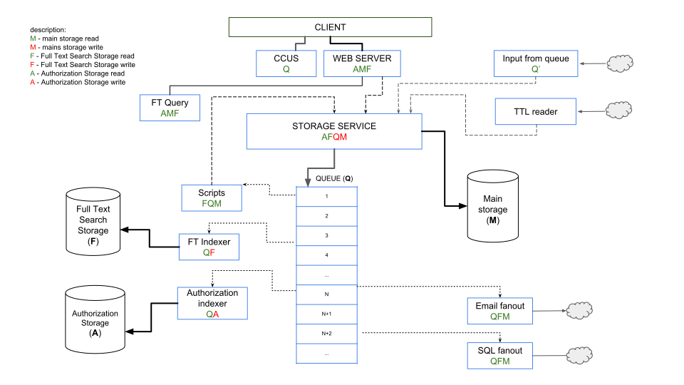

# Платформа VEDA.
## Руководство по разработке приложений.

#### Предисловие
Данное руководство содержит справочную информацию по платформе VEDA и охватывает наиболее важные темы разработки бизнес-приложений на платформе.

Для успешного создания приложений требуется знание следующих технологий:

RDF/RDFS, OWL, Turtle, RDFa, HTML, CSS, JavaScript, git

Для глубокого понимания принципов работы платформы полезным является знакомство со следующими технологиями и фреймворками:

linux(basic), http, websocket

Если у Вас имеются предложения по улучшению данного руководства или если вы увидели ошибку в документе, сделайте fork репозитория на GitHub. Мы будем рады принять ваши pull request’ы и issues.

#### Общие сведения
VEDA - это платформа для создания и исполнения бизнес приложений. Исходный код платформы открыт для всех и распространяется бесплатно на условиях лицензии GPLv3.
В основе платформы лежат технологии семантического веба. Это означает что при создании приложения, предметная область (структуры данных и их взаимоотношения) формулируется с помощью словаря описания онтологий OWL/RDF.
Платформа имеет двухзвенную архитектуру и состоит из серверной части и клиентского приложения выполняющегося в браузере пользователя.

#### Возможности и преимущества
Технологии семантического веба дают возможность единообразно описать сущности предметной области. Единое информационное пространство для пользователей работающих в приложениях платформы обеспечивается повторным использованием ранее описанных понятий.
Платформа и используемые технологии помогают разработчику добиваться интеграции данных на семантическом уровне.
Изменения описаний структур данных приложения, при условии сохранении логической совместимости, загружаются в систему на лету и не требуют специальных действий по администрированию сервера.

### 1. Установка и настройка

#### 1.1. Сервер
Сервер платформы состоит из набора онтологий, ряда js скриптов а так-же нескольких бинарных файлов, которые требуется предварительно скомпилировать.
Есть возможность воспользоваться уже собранной платформой, для этого смотрите пункт *[1.1.1 Установка заранее собранной системы]*, в этом варианте количество установленных зависимостей значительно меньше а так-же отсутствует время на компиляцию.

Если требуется вносить изменения в ядро платформы то возможно самостоятельно собрать платформу: *[1.2 Самостоятельная сборка из исходных текстов]*, нужно учесть что в таком варианте понадобится не менее 2 ГБ оперативной памяти.

##### Системные требования
- 64-битная операционная система - linux ubuntu 16.04
- Оперативная память - 1 ГБ минимум, 4 ГБ рекомендуется
- CPU ?
- Место на жестком диске - 5 ГБ.

##### 1.1.1 Установка заранее собранной системы
Готовую, собранную заранее платформу можно взять с сайта github.
Для установки последней собранной версии платформы следует выполнить команду git clone https://github.com/semantic-machines/veda-dist.git, далее запустить скрипт ./tools/install-dependencies.sh

##### 1.1.2 Самостоятельная сборка из исходных текстов
Исходные файлы проекта, можно взять на сайте github, для этого следует выполнить команду git clone https://github.com/semantic-machines/veda.git

Для работы серверной части системы потребуются компоненты от других разработчиков, все они являются открытыми и могут быть установлены путем запуска скрипта ./control-install.sh

После установки всех зависимостей можно выполнить сборку исполняемых файлов, для этого следует выполнить скрипт ./build.sh

##### 1.1.3 Настройка и запуск
Настройки для конфигурирования сервера находятся в файле ./veda.properties.

На первом этапе вам может понадобится внести изменение в настройки tcp портов.
По умолчанию сервер будет производить взаимодействие с клиентской частью по двум портам 8080 и 8088. При необходимости вы можете их перенастроить на необходимые вам.

Порт по которому пользователь будет попадать в систему задается параметром - http_port.
Второй порт отвечает за отправку в клиентское приложение уведомлений об изменениях в данных и задается параметром ccus_port. Более подробно параметры конфигурирования сервера рассмотрены в разделе [администрирование сервера].
Старт сервера производится командой ./control-start.sh .

При первом запуске, когда база данных пустая, может понадобится некоторое время, примерно около минуты, в течении которого онтология платформы располагающаяся в папке ./onto, будет переносится в базу данных.
Последующие запуски будут выполнятся без какой либо задержки, то есть практически мгновенно. После того как серверная часть стартовала, можно перейти в браузер по адресу http://localhost:8080.

При первом запуске системы есть возможность проверить работоспособность компонентов платформы, для этого в браузере перейдите по адресу адресу http://localhost:8080/tests, в норме все тесты должны пройти успешно.
Остановку сервера можно произвести командой ./control-stop.sh

#### 1.2. База данных
Все файлы базы данных располагаются в папке ./data, которую при необходимости можно прилинковать за пределы рабочей папки платформы.
Мастер данные хранятся в базе типа ключ значение - tarantool [https://tarantool.io]
Производные данные, такие как индексы полнотекстового поиска и индексы авторизации, хранятся в других базах, к которым прямой доступ из вне ограничен.

#### 1.3. Модули
Платформа содержит в своем составе менеджер модулей, который позволяет устанавливать/удалять сторонние модули учитывая версионность самих модулей и их зависимостей.

#### 1.4. Клиентская часть, веб-браузер

##### Системные требования
- операционная система - windows, linux, OSX
- Оперативная память - 1 ГБ минимум, ? ГБ рекомендуется
- CPU ?

Веб-интерфейс приложений, создаваемых на основе платформы, работает в современных браузерах, таких как Google Chrome, Mozilla Firefox, Internet Explorer 11, Microsoft Edge.

#### 1.5. Cредства разработки

В процессе создания приложения, специальных средств разработки как правило не требуется, достаточно простых текстовых редакторов, однако некоторые инструменты могут облегчить разработку.

Для редактирования онтологий можно использовать программу *Protege*: https://protege.stanford.edu/
это бесплатный open-source редактор, либо более продвинутый инструмент *TopBraid Composer Standard Edition*.

### 2. Быстрый старт

В данном разделе рассматривается создание простого приложения, в качестве средства разработки в данном примере будем использовать обычный текстовый редактор.
При этом содержимое файла должно соответствовать правилам разметки [N3](https://ru.wikipedia.org/wiki/%D0%9D%D0%BE%D1%82%D0%B0%D1%86%D0%B8%D1%8F_3) для RDF данных.

Перед тем как приступать к созданию тестового приложения убедитесь что вы выполнили рекомендованные действия из пункта
[1. Установка и настройка](#1-%D1%83%D1%81%D1%82%D0%B0%D0%BD%D0%BE%D0%B2%D0%BA%D0%B0-%D0%B8-%D0%BD%D0%B0%D1%81%D1%82%D1%80%D0%BE%D0%B9%D0%BA%D0%B0)

Основные задачи, стоящие при разработке нашего приложения:

- Разработка модели данных, которая заключается в создании сущностей предметной области.

- Разработка экранных форм пользовательского интерфейса, позволяющих создавать, просматривать, обновлять и удалять сущности модели данных.

### 2.1. Описание задачи

Приложение предназначено для ведения сведений о покупателях и их заказах.

*Покупатель имеет следующие характеристики:*

- Имя
- Электронная почта


*Характеристики заказа:*

- Принадлежность покупателю
- Дата
- Сумма


*Пользовательский интерфейс приложения должен содержать:*

- Форму списка покупателей;
- Форму редактирования сведений о покупателе, содержащее также список заказов данного покупателя;
- Форму общего списка заказов;
- Форму редактирования заказа.

### 2.2. Создание проекта

В данном примере, для простоты мы не будем использовать возможности менеджера модулей, более подробно с этой технологией можно ознакомится в разделе [Менеджер модулей].

Для нашего примера создадим текстовый файл sales.ttl, который в дальнейшем будет в себе содержать все сущности данного проекта.

#### заголовок файла проекта
```
@prefix owl: <http://www.w3.org/2002/07/owl#> .
@prefix rdf: <http://www.w3.org/1999/02/22-rdf-syntax-ns#> .
@prefix rdfs: <http://www.w3.org/2000/01/rdf-schema#> .
@prefix cs: <http://company-sales.com/sample/sales/> .

<http://company-sales.com/sample/sales>
  rdf:type owl:Ontology ;
  rdfs:isDefinedBy cs: ;
  rdfs:label "Тестовый пример - Продажи"@ru ;
  rdfs:label "Sample - Sales"@en ;
.
```
Рассмотрим из чего состоит заголовок файла:
В самой верхней части файла мы описываем префиксы содержащие в себе ссылки на сторонние онтологии, префикс для нашего проекта зададим следующим образом:

```
@prefix cs: <http://company-sales.com/sample/sales/> .
```
где **cs:** - пространство имен, которое будет использоваться как префикс имен сущностей нашего примера.

**http://company-sales.com/sample/sales/** - ссылка на репозиторий онтологий нашей вымышленной компании.

Далее идет сущность которая будет корневой для других сущностей нашей бизнес области.
```
<http://company-sales.com/sample/sales>
  rdf:type owl:Ontology ;
  rdfs:isDefinedBy cs: ;
  rdfs:label "Тестовый пример - Продажи"@ru ;
  rdfs:label "Sample - Sales"@en ;
.
```

### 2.3. Создание сущностей

Создадим класс сущности Customer (покупатель).

```
cs:Customer
  rdf:type rdfs:Class ;
  rdfs:label "Customer"@en ;
  rdfs:label "Покупатель"@ru ;
.

```

Обратите внимание что **cs:Customer** это экземпляр класса **rdfs:Class**, таким образом мы описываем новый класс.

Далее создадим атрибуты сущности.

Начнем с аттрибута **name**, для этого создадим экземпляр класса **owl:DatatypeProperty**

```
cs:name
  rdf:type owl:DatatypeProperty ;
  rdfs:label "Имя"@ru ;
  rdfs:label "Name"@en ;
  rdfs:domain cs:Customer ;
  rdfs:range xsd:string ;
.
```

Здесь предикат **rdfs:domain** указывает принадлежность атрибута **cs:name** к классу **cs:Customer**,
а предикат **rdfs:range** задает тип string для хранимых данных в данном атрибуте.
Так же мы стали использовать новый префикс **xsd:** и поэтому его следует внести в заголовок нашего файла.

Теперь верхняя часть файла с описанием префиксов будет выглядеть так:
```
@prefix owl: <http://www.w3.org/2002/07/owl#> .
@prefix rdf: <http://www.w3.org/1999/02/22-rdf-syntax-ns#> .
@prefix rdfs: <http://www.w3.org/2000/01/rdf-schema#> .
@prefix xsd: <http://www.w3.org/2001/XMLSchema#> .
@prefix cs: <http://company-sales.com/sample/sales/> .
```

Атрибут **email** создается таким же образом:

```
cs:email
  rdf:type owl:DatatypeProperty ;
  rdfs:label "email" ;
  rdfs:domain cs:Customer ;
  rdfs:range xsd:string ;
.
```

На этом создание сущности **Customer** можно считать завершенным.
Перейдем к созданию сущности Order (заказ).

```
cs:Order
  rdf:type rdfs:Class ;
  rdfs:label "Order"@en ;
  rdfs:label "Заказ"@ru ;
.
```

опишем его атрибуты:

```
cs:hasCustomer
  rdf:type owl:ObjectProperty ;
  rdfs:label "has customer"@en ;
  rdfs:domain cs:Order ;
  rdfs:range cs:Customer ;
.
```

Обратите внимание что для описания ссылки на другую сущность мы создали экземпляр класса **owl:ObjectProperty**

Создадим оставшиеся атрибуты **date** и **amount**:

```
cs:date
  rdf:type owl:DatatypeProperty ;
  rdfs:label "date" ;
  rdfs:domain cs:Order ;
  rdfs:range xsd:dateTime ;
.

cs:amount
  rdf:type owl:DatatypeProperty ;
  rdfs:label "amount" ;
  rdfs:domain cs:Order ;
  rdfs:range xsd:decimal ;
.
```

Описание объектной модели завершено, переходим к описанию экранных форм.

### 2.4. Создание форм пользовательского интерфейса

Создадим формы приложения, позволяющие управлять информацией о покупателях и заказах.

#### 2.4.1. Экраны управления Покупателями

-

#### 2.4.2. Экраны управления Заказами

-

#### 2.4.3. Меню приложения

-

#### 2.4.4. Экран редактирования Покупателя со списком Заказов

-

### 2.5. Запуск приложения

Посмотрим, как созданное нами описание выглядит в виде готового приложения.

##### 2.5.1 Загрузка онтологии

Убедитесь что сервер запущен или произведите его запуск командой ./control-start.sh

Один из путей размещения онтологии на сервер, это поместить файл sales.ttl в папку ./onto. Cервер должен обнаружить новый файл, проверить его и если синтаксис не нарушен, внести изменения в базу данных.

##### 2.5.2 Тестирование приложения

Зайдите в систему, использовав имя [admin] и пароль [123] в окне логина. Откройте пункт меню ?


### 3. Устройство платформы

Данная глава содержит подробное описание архитектуры, компонентов и механизмов платформы.

### 3.1. Архитектура приложения

В данной главе рассмотрена архитектура VEDA-приложений в различных разрезах: по уровням и модулям.

#### 3.1.1. Уровни приложения

Платформа позволяет строить многоуровневые приложения с выделенными клиентским и серверным уровнями.

##### Сервер

Слой, содержащий описание предметной области, клиентскую и серверную бизнес-логику приложения и выполняющий обращения к базе данных.


##### Клиент

Приложение выполняющееся в веб браузере на JavaScript, и предоставляющее пользовательский интерфейс для внешних пользователей. Поведение и внешний вид клиента зависит от описания предметной области, и клиентской бизнес-логики, которые хранятся на уровне сервера.
Клиентская часть работает с серверным слоем через HTTP API и websocket.

#### 3.1.2. Модули приложения

Приложение для своего функционирования может требовать наличие других модулей, это задается в в разделе зависимости, в сущности описывающей модуль.

Само приложения так же является модулем и может в дальнейшем использоваться для построения других приложений.


### 3.2. Архитектура платформы

В данной главе рассмотрена архитектура платформы в разрезе компонентов и функциональных блоков, также структура и направление потоков информации.

#### 3.2.1 Серверные компоненты и их функциональные блоки

- **veda-mstorage**

  - Аутентификация.
  - Авторизация изменений.
  - Запись в основное хранилище сущностей.
  - Индексация сущностей для последующей авторизации.
- **veda-ft-indexer**

  - индексация сущностей для полнотекстового поиска.
- **veda-ft-query** (возможен одновременный запуск необходимого количества)
  - Выполнение запросов к полнотекстовому поиску.
  - Авторизация полученных результатов.
- **veda-fanout-email**

  - Отправка по e-mail.
- **veda-fanout-sql-np**

  - Выгрузка в SQL.
- **veda-scripts**

  - Исполнение скриптов.
- **veda-ttlreader**

  - Чтение ttl файлов, извлечение из них сущностей.
  - Подключение к очереди другого экземпляра системы Veda.
- **veda-ccus**

  - Обслуживание websocket API (уведомление об изменениях).
- **veda-gowebserver** (возможен одновременный запуск множества веб-серверов)

  - Обслуживание HTTP API.

  - Авторизация запрашиваемых сущностей.

    



##### рисунок 1. Функциональные части платформы veda и движение потоков информации.


#### 3.2.2 Жизненный цикл обработки информации: 

*Пути поступления информации в систему:*

1. Чтение ttl файлов доступ к которым имеет серверная часть.
2. HTTP API
   - Пользователь посредством веб интерфейса производит создание или модификацию сущностей.
   - Другие системы могут получать и отправлять сущности.
3. Чтение очереди другого экземпляра системы Veda.

*Обработка поступившей информации на стороне сервера:*

На серверной стороне, компонент хранения обрабатывает поступившие сущности и после проверки прав доступа, сохраняет в мастер базу, а так-же складывает в очередь. При этом в очередь сохраняются два состояния: сущность до изменений и ее новое состояние. 
Далее компонент хранения уведомляет остальные части системы  о поступлении новых данных. На следующей стадии каждый из компонентов считывает из очереди новую порцию данных, и исходя из содержимого делает вывод о том следует обрабатывать или пропустить. 
Каждый из компонентов системы может содержать свои базы данных и алгоритмы работы. В процессе обработки поступившей сущности, могут быть сгенерированны новые сущности которые будут отправлены в компонент хранения и далее цикл обработки повторится.


### 3.3. API для клиентского слоя

**HTTP API предоставляет следующую функциональность:**

- Аутентификация пользователя и получение сессионного билета.
- Проверка сессионного билета на валидность.
- Сохранение одной или нескольких сущностей.
- Получение одной или нескольких по их ID.
- Удаление сущности.
- Добавление, обновление, удаление заданного поля в сущности.
- Получение разрешений для текущего пользователя и сущности.
- Загрузка и скачивание файлов.
- Получение информации о текущей позиции в очереди для каждого серверного компонента
- Поддерживает анонимный доступ c ограниченными правами.

**websocket API служит для оперативного получения изменений в сущностях и состоит из следующих команд:**

- Получить текущий набор подписок .
- Подписка на изменения одной или нескольких сущностей.
- Отменить подписку для  одной или нескольких сущностей.
- Отменить все подписки.

  


------

### Основные определения и понятия
- Обьект - набор полей с данными
- Сущность - объект, имеющий идентификатор, с помощью которого система адресуется к содержимому данного обьекта.
- Предикат - связи между понятиями или экземплярами (таксономические, родственные, 
  производственные), а также свойства сущности (цвет, длина, вкус);
- Classes - классы
- Individuals – экземпляры класса
- Data properties – свойства-литералы
- Object properties – свойства-указатели на объекты


